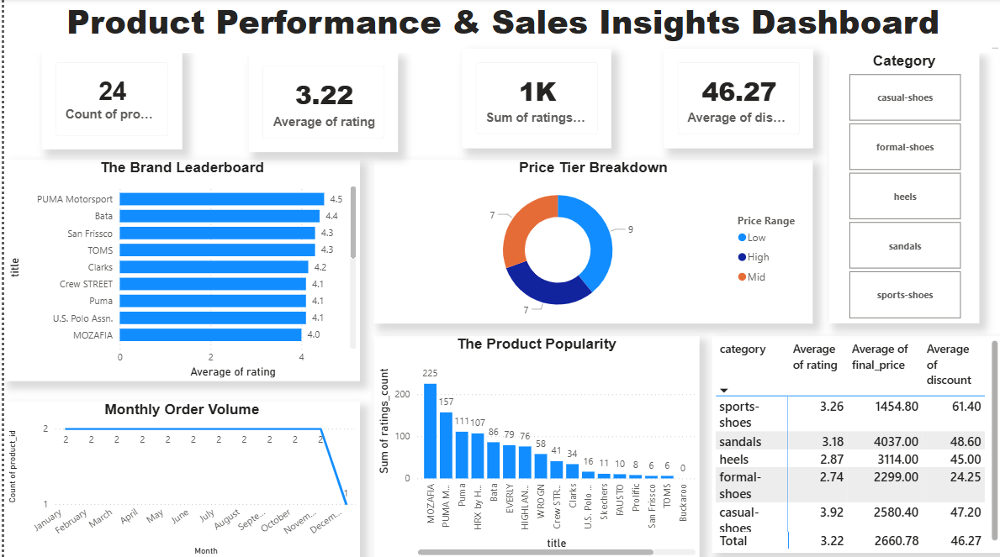
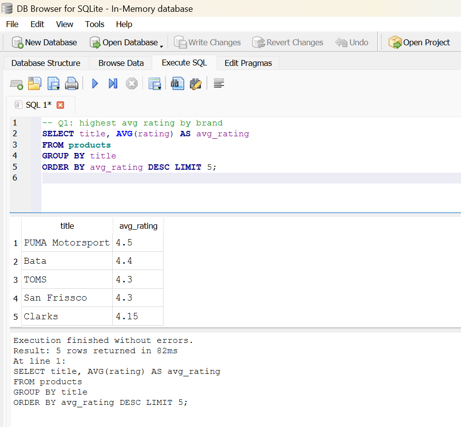
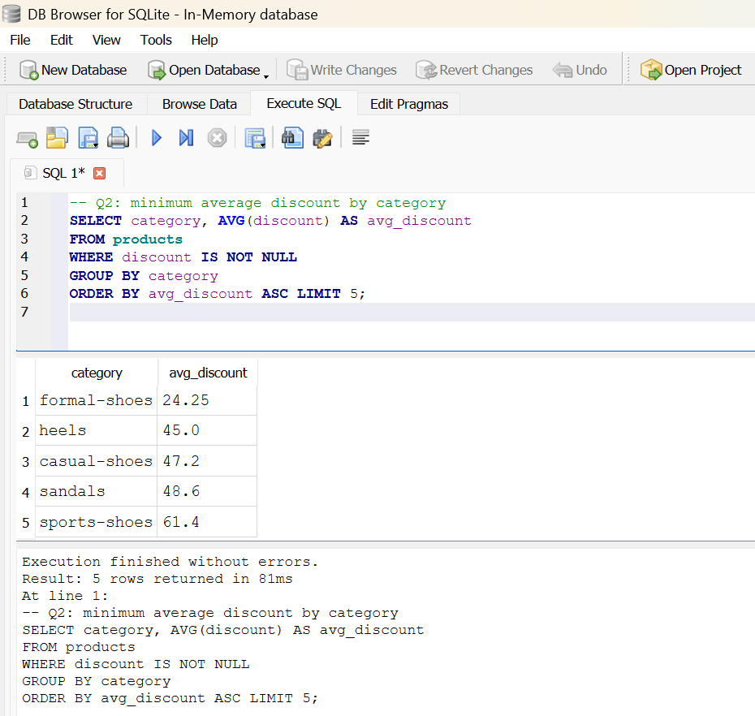
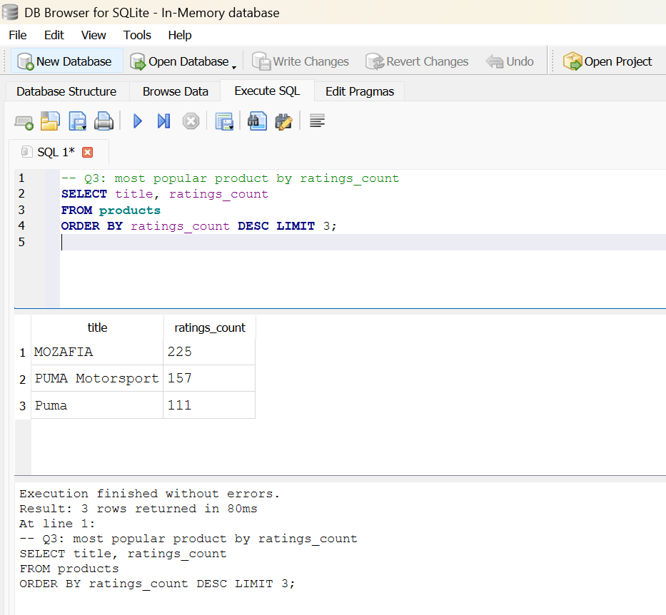
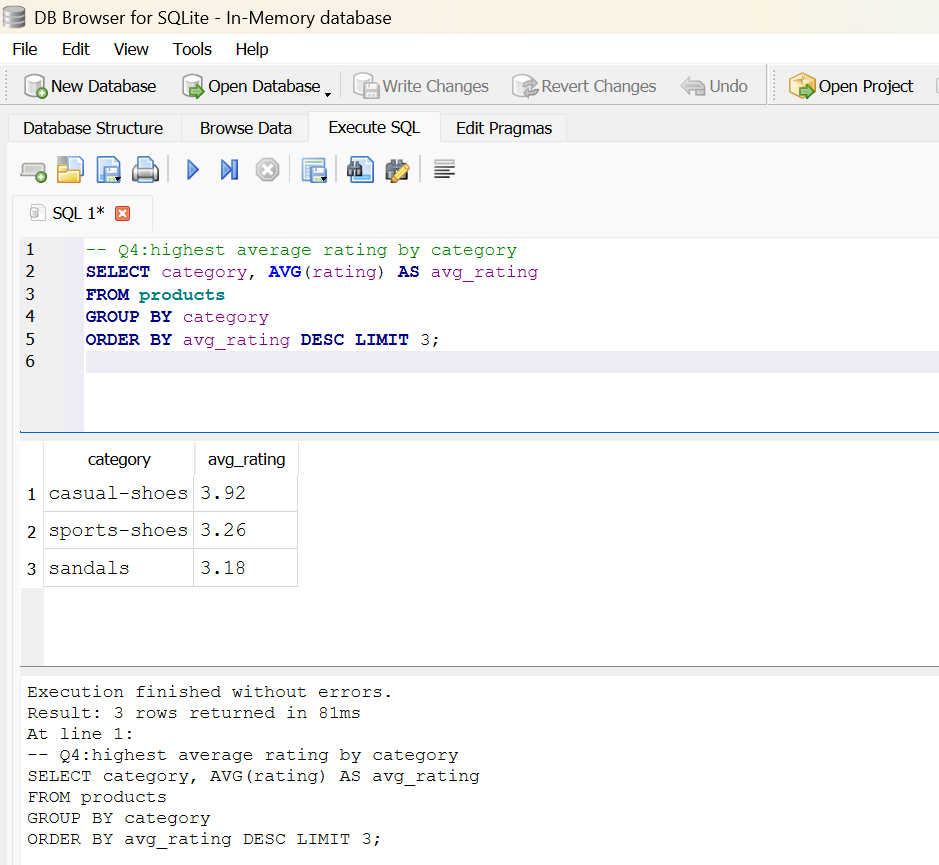
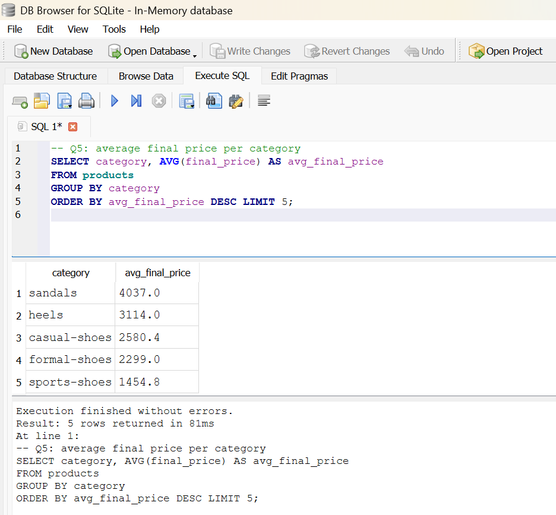
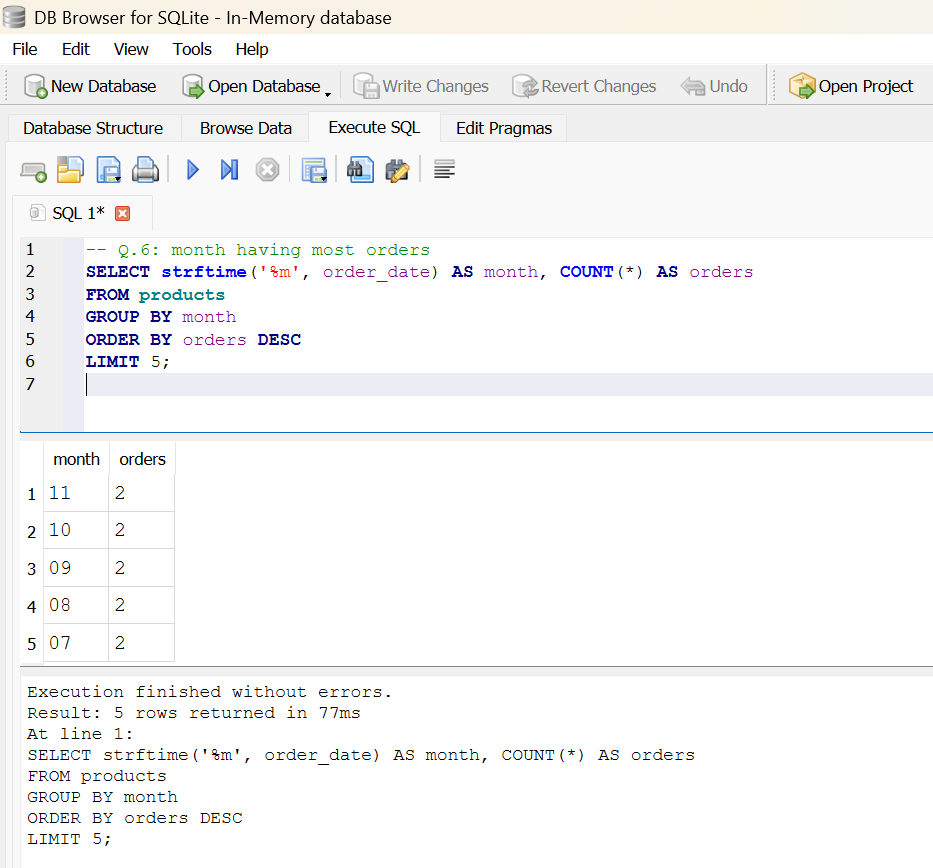
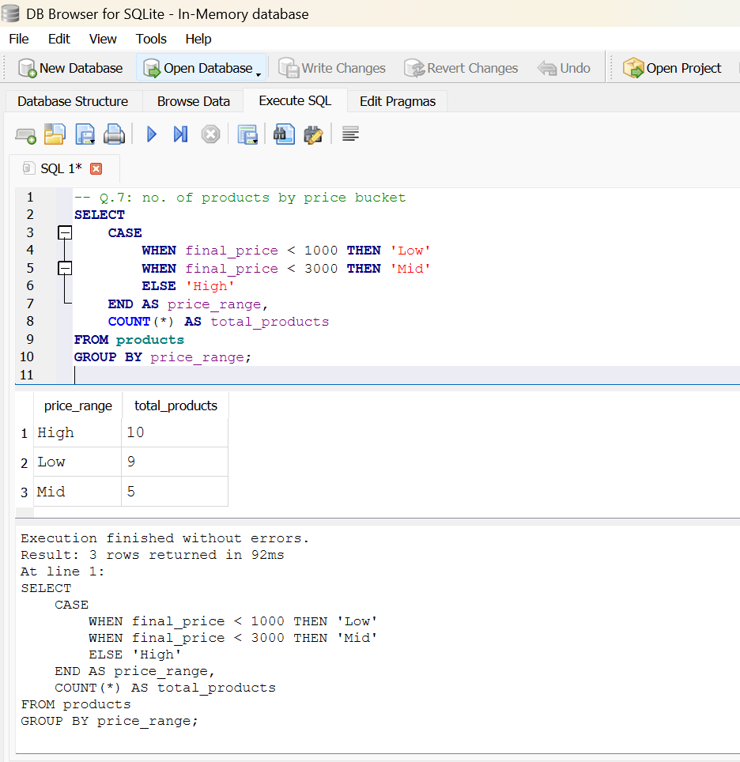
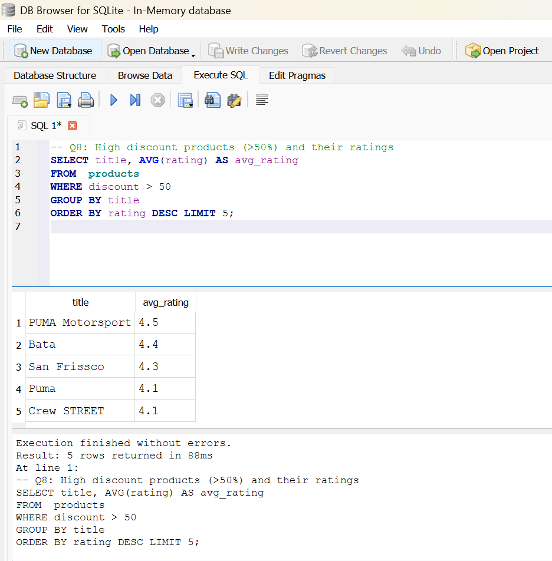

# Task 1 — Myntra_Fashion_Analysis_2024

## Project Overview

This project is a complete business analytics case study based on 
Myntra fashion e-commerce data. The dataset contains 24 products 
across 5 footwear categories including casual shoes, formal shoes, 
sports shoes, sandals, and heels. The goal is to extract meaningful 
business insights using SQL queries, statistical analysis, and data 
visualization to help non-technical managers make data-driven decisions.

## Product Performance & Sales Insights Dashboard

To translate our analytical findings into actionable business strategy, I developed an interactive Power BI dashboard tracking sales velocity, product performance, and regional customer trends.



### Key Features Demonstrated:

* **Advanced Data Modeling:** Developed a robust star schema utilizing a centralized facts table connected to optimized dimension tables for seamless cross-filtering.
* **Dynamic DAX Measures:** Formulated customized DAX expressions to track key performance indicators (KPIs), year-over-year sales growth, and moving averages.
* **Actionable Business UI:** Designed a clean, scannable user interface tailored for retail stakeholders to quickly identify underperforming product categories and high-value regional markets at a glance.

## Dataset
- Source: Myntra fashion dataset
- Rows: 24
- Columns: 9
- Time period: 2024

## Tools Used
- SQL (DB Browser for SQLite)
- Python (hypothesis test)
- Power BI / Tableau (dashboard)

## Business Questions Answered

### Q1: Which brand generates the highest average rating?

```sql
SELECT title, AVG(rating) AS avg_rating
FROM products
GROUP BY title
ORDER BY avg_rating DESC LIMIT 5;
```


**Answer:** Puma Motorsport is the brand generated 4.5 the highest average rating.

### Q2: What is the minimum average discount by category?
```sql
SELECT category, AVG(discount) AS avg_discount
FROM products
WHERE discount IS NOT NULL
GROUP BY category
ORDER BY avg_discount DESC LIMIT 5;
```


**Answer:** Formal_shoes is the category with 24.25 min avg_discount.

### Q3: What is the most popular product by ratings_count?
```sql
SELECT title, ratings_count
FROM products
ORDER BY ratings_count DESC LIMIT 3;
```



**Answer:** Mozafia is the most popular product with 225 ratings_count.

### Q4: Which category generates the highest average rating?

```sql
SELECT category, AVG(rating) AS avg_rating
FROM products
GROUP BY category
ORDER BY avg_rating DESC LIMIT 5;
```

**Answer:** Casual_shoes is the category generated 3.92 the highest average rating.

### Q5: What is average final price per category?

```sql
SELECT category, AVG(final_price) AS avg_final_price
FROM products
GROUP BY category
ORDER BY avg_final_price DESC LIMIT 5;
```


**Answer:** Sandals is the category with 4035 highest average final price.

### Q6: Which month is having most orders?

```sql
SELECT strftime('%m', order_date) AS month, COUNT(*) AS orders
FROM products
GROUP BY month
ORDER BY orders DESC LIMIT 5;
```


**Answer:** The months from July to November have the most orders, with 2 orders each.

### Q7: What are total products by price range?

```sql
SELECT 
    CASE
        WHEN final_price < 1000 THEN 'Low'
        WHEN final_price < 3000 THEN 'Mid'
        ELSE 'High'
    END AS price_range,
    COUNT(*) AS total_products
FROM products
GROUP BY price_range;
```


**Answer:** The price ranges (High, Mid, Low) are for the total products (10, 9, 5) respectively.


### Q8: What are the high discounted products by average rating?

```sql
SELECT title, AVG(rating) AS avg_rating
FROM products
WHERE discount > 50
GROUP BY title
ORDER BY avg_rating DESC LIMIT 5;
```


**Answer:** The high discounted product is Puma Motorsport with 4.5 average rating.

## Key Findings
- Puma Motorsport has highest avg rating
- casual-shoes has highest avg rating
- formal-shoes has lowest discount
- MOZAFIA is most popular product
- sandals have highest avg price
- months from July to November having most orders
- The price ranges (High, Mid, Low) with no. of products (10, 9, 5)
- Puma Motorsport is the high discounted product

## Files in this Project
- queries.sql → all SQL queries
- screenshots/ → query results
- report.pdf → full analytics report

## Final Statistical Conclusion

### Statistical Decision:
We are fail to reject Null Hypothesis because P_Value = 0.6985944422551309 about 70% is much higher than alpha=0.05 about 5%.

### Business Insight:
There is no statistically significant difference in customer ratings between high-discount products and low-to-medium-discount products. For Myntra's managers, this suggests that offering high discounts does not systematically increase or decrease customer satisfaction ratings for these footwear items. The slight variation observed is likely due to random sample noise.